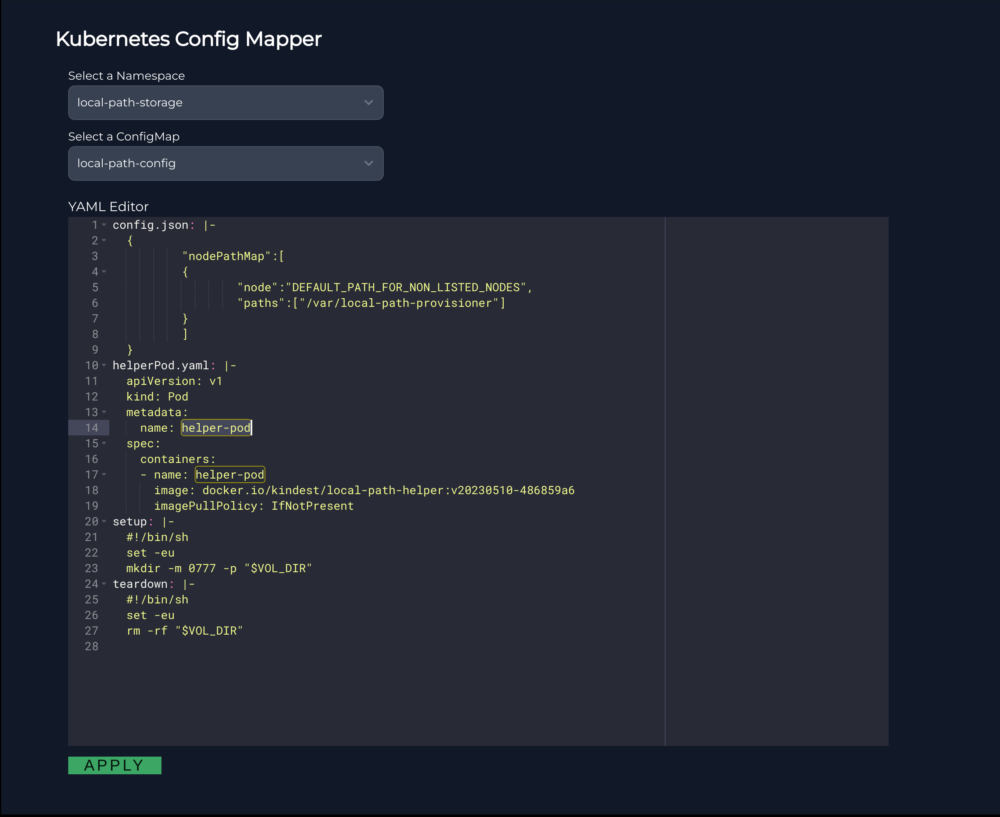

# Kubernetes ConfigMap Editor
`Enjoy editing your Kubernetes config map with a user-friendly web editor!`

## How it works
We can use this tool to manage k8s resources in two ways -
1. In Cluster - Means we are running this app in a k8s cluster (via `helm`)
2. Outside of Cluster - Means we are running this application standalone either in our host as a container (requires `kubeconfig` for authentication)

## Installation

1. For `incluster` installation  
   - `make kube-up`
   - `kubectl port-forward deployments/k8s-cm-mapper 8080:8080`

Note: for security reasons the pods is configured to work with `default` namespace only. To change the behavior you need to tweak with [ConfigMap RBAC Policies](./helm/k8s-config-mapper/templates/cm-rbac.yaml) and [Namespace RBAC Policies](./helm/k8s-config-mapper/templates/ns-rbac.yaml)

2. For `remotecluster` installation
   - `make docker-up`
   - or `go run ./... remotecluster`

visiting to `localhost:8080` should load a page like below if all ran successfully -

